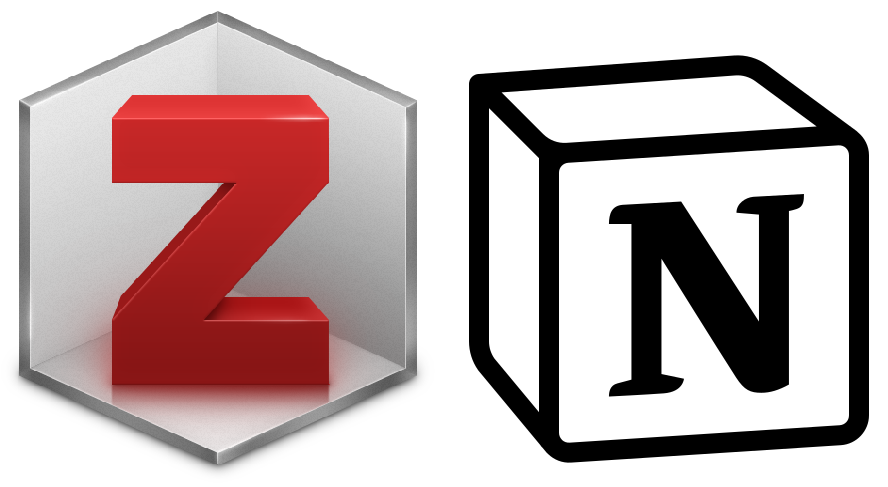
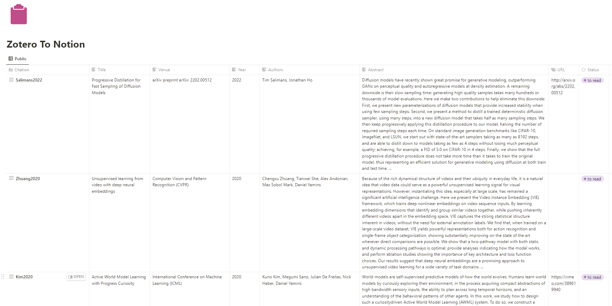

<div align="center">    
 
# Zotero To Notion  


  
</div>
 
## Description   
This project allows you to export newly added or recently updated documents in Zotero (local database, synced via Google Drive) to your Notion database via the Notion APIs and by reading the `zotero.sqlite` database LOCALLY. If you'd like the export to happen as soon as you make a change in Zotero, then you can run the script `scripts/runZoteroToNotion.sh` peridocially at a reasonable frequency via a `crontab` job. 

## Directory Structure

```
.
+-- docs/
|   +-- images/
|   |   +-- demo.png
|   |   +-- icon.png
+-- globalStore/
|   +-- constants.py
+-- lib/
|   +-- port_utils.py
|   +-- utils.py
+-- notebooks/
|   +-- Trial_ZoteroDatabase.py
+-- scripts/
|   +-- runZoteroToNotion.sh
+-- secrets/
|   +-- secrets_notion.json
|   +-- secrets_zotero.json
+-- src/
|   +-- zoteroToNotion.py
+-- tests/
|   +-- testNotionAPI.py
|   +-- testZoteroRead.py
+-- .gitignore
+-- juyptext.toml
+-- LICENSE
+-- README.md
+-- requirements.txt
+-- STDOUTlog_examples.txt
```


---

---

## Usage
1. Create a python conda env using `requirements.txt`
2. Ensure that the plugins `BetterBib` and `Zotfile` are installed. If you want to run this on an automated schedule on server using Crontab, one option is to ensure your local Zotero database is synced to an accessible path via Google Drive and use it as a READ_ONLY_DIRECTORY.
3. Register a private integration on your Notion workspace (follow instructions [online](https://www.notion.so/help/create-integrations-with-the-notion-api#create-an-internal-integration))
4. Obtain its `notionToken`
5. Create a database on Notion to contain all the entries from Zotero. Make sure it has the following properties. If you want to add more properties or remove, modify the function `getDataFromZoteroDatabases` and `getNotionPageEntryFromPropObj` in `lib/port_utils.py`.
```
Title property: Citation
Text properties: Title, UID, Authors, Venue, Year, Abstract, Type, BibTex, Filename, Collection Names, Zotero Tags
Url properties: URL
Date properties: Created At, Last Modified At
```
6. Get its `databaseID` and add it to `secrets/secrets_notion.json` in the following format:
```
{
    "notionToken": "your notion token",
    "databaseID": "your notion database ID"
}
```
7. Run the python script `src/zoteroToNotion.py` with `--copyZotero` argument as True (default)
8. Currently, the logic reads all items from the Zotero database and all items in the Notion database. For each item in Zotero, we check if it already exists in Notion. If yes, we check if the last modified time on Zotero is AFTER the last edited time in Notion. If yes, we update the Notion entry. If not, there's nothing to update. If the Zotero item doesn't exist in Notion, we create a brand new row in Notion.
9. You can periodically run this file again as a script `scripts/runZoteroToNotion.sh` using a crontab job to get periodic updates. For more information on Crontab, check out this [reference](https://crontab.guru/).

## Requirements

You can install all the requirements using the following command:

```
pip install -r requirements.txt
pip install -e .
```

## Sources

- [Notion API Python SDK](https://github.com/ramnes/notion-sdk-py)
- [Zotero](https://www.zotero.org/)

## If you use it in your work and want to adapt this code, please consider starring this repo or forking from it!

```
@misc{nanbhas2022_zoteroToNotion,
  title={Zotero To Notion},
  author={Nandita Bhaskhar},
  howpublished={GitHub Repo, https://github.com/nanbhas/ZoteroToNotion},
  year={2022}
}
```  
 

